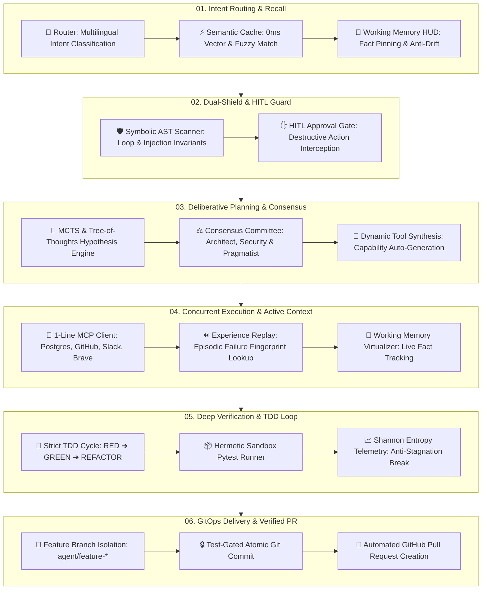
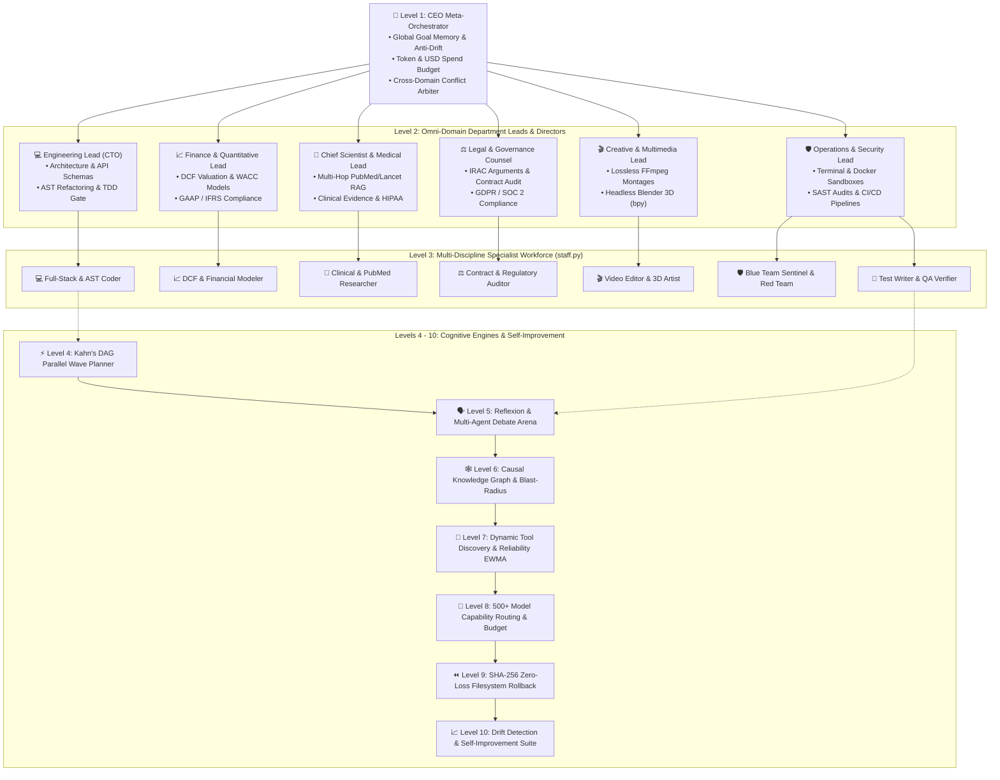
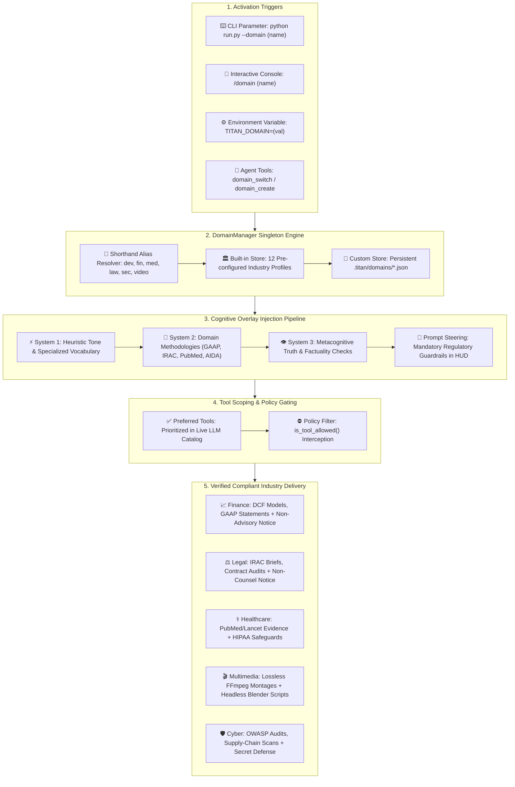

# Universal Agent HP

[](https://github.com/kapitan00000978-sketch/Universal-Agent-HP/actions/workflows/tests.yml)
[](https://opensource.org/licenses/MIT)
[](https://www.python.org/downloads/)
[](#architecture-genesis-10-level-cognitive-swarm-hierarchy-levels-1---10)
[](#testing--security)

Universal Agent HP is an autonomous AI software engineering and operations operating system built for real-world production environments. It fuses **Tri-Loop Metacognitive Reasoning**, an **Autonomous TDD Engine**, **Anthropic Model Context Protocol (MCP)** integration, **Human-in-the-Loop Guardrails**, and **Local Semantic Caching** into a verified, drift-free execution framework.

```
   ┌────────────────────────────────────────────────────────────────────────┐
   │                         UNIVERSAL AGENT HP                             │
   │                                                                        │
   │   [System 1: Fast Intuition] ──> Instant Heuristic Path (0ms)          │
   │   [System 2: Planning Engine] ──> MCTS + Bayes Reasoning + TDD Loop     │
   │   [System 3: Metacognitive]   ──> Shannon Entropy + Dynamic Synthesis  │
   │   [Active Working Memory]     ──> Pinned Operational HUD (No Drift)    │
   └────────────────────────────────────────────────────────────────────────┘
```

---

## Why Universal Agent HP? (Real-World Use Cases)

Universal Agent HP is engineered to solve acute, real-world engineering bottlenecks for developers, teams, and enterprises:

### 1. Autonomous Software Engineering & Self-Healing Bug Fixes
* **The Problem:** Developers spend hours manually isolating bugs, crafting regression tests, and repeatedly testing code fixes.
* **Universal Agent Solution:** Upon receiving an issue or bug report, the agent executes an autonomous **TDD cycle**: writes a failing verification test (`pytest`), confirms failure (RED), writes minimal passing code (GREEN), and asserts AST safety invariants (REFACTOR). If tests fail, the self-healing loop autonomously debugs and iterates until 100% green.

### 2. Safe GitOps: Automated Feature Branching & Pull Requests
* **The Problem:** Blind AI code agents directly writing to `main` or committing unverified code can compromise codebase stability.
* **Universal Agent Solution:** Isolates all development inside dedicated `agent/feature-<slug>` branches. The commit engine enforces a strict pass gate on the test suite before any git commit is permitted. Once verified, it automatically opens a formatted, context-rich Pull Request via `gh pr create`.

### 3. One-Line Ecosystem Integration (Anthropic Model Context Protocol)
* **The Problem:** Writing custom API adapters for disparate enterprise databases and services is slow and error-prone.
* **Universal Agent Solution:** Standardized MCP client enables 1-line connection to any industry-standard server:
  * `postgres`: Direct SQL inspection, schema analysis, and migrations
  * `github`: Repository management, issues, and PR workflows
  * `slack`: Real-time alerts, messaging, and team collaboration
  * `brave_search`: Live web search for latest documentation and dependencies
  * `filesystem` & `sqlite`: Secure local sandboxes and query engines

### 4. Halting Catastrophic Actions (Human-in-the-Loop Safety)
* **The Problem:** AI agents inadvertently executing destructive commands (`rm -rf`, `delete_file`, `git push --force`, or leaking credentials in `.env`).
* **Universal Agent Solution:** The `DangerousActionClassifier` intercepts irreversible actions and halts execution, prompting the operator across Terminal TUI, Web Dashboard, or Telegram:
  > *«Bu fayllarni/amallarni o‘zgartirmoqchiman. Ruxsat berasizmi? [Ha / Yo‘q]»*  
  Zero destructive actions execute without explicit human authorization.

### 5. Slashing LLM Token Costs by 30–40% (Semantic Caching)
* **The Problem:** Repetitive tool calls, static file reads, and semantically equivalent queries needlessly burn expensive model tokens.
* **Universal Agent Solution:** An embedded SQLite vector cache (`semantic_cache.db`) calculates word cosine similarity, returning **0ms** responses for matching or near-equivalent requests, cutting LLM bills by 30–40% with live token and dollar savings telemetry.

### 6. Continuous Learning from Historical Mistakes (Episodic Experience Replay)
* **The Problem:** Most AI agents repeat identical syntax, version conflict, and dependency errors across different sessions.
* **Universal Agent Solution:** Maintains an episodic failure repository (`experience_replay.db`). When runtime exceptions occur, it records normalized error fingerprints and verified remediation diffs, instantly recalling proven solutions when encountering similar errors in the future.

### 7. 100% Private & Air-Gapped Local AI
* **The Problem:** Organizations cannot expose proprietary source code to public third-party cloud APIs.
* **Universal Agent Solution:** First-class native integration with `Ollama` and `LM Studio` runs models entirely locally on your hardware. Zero bytes leave your infrastructure.

---

## Transparent Capabilities: What It Can and Cannot Do

### ✅ Real, Verified Capabilities (Backed by 675+ Passing Tests):
1. **Tri-Loop Metacognitive Reasoning Engine:**
   * **System 1 (Fast Intuition):** 0ms instant heuristic dispatch bypassing tool execution for direct conversational prompts.
   * **System 2 (Deliberative Planning):** Tree-of-Thoughts, Multi-Hop ReAct, and Monte Carlo Tree Search (MCTS) with Bayesian hypothesis tracking.
   * **System 3 (Metacognitive Overseer):** Real-time monitoring of Shannon cognitive entropy and stagnation breakers that autonomously pivot strategy when stuck.
2. **Surgical AST Code Patching:** Identifies exact AST target nodes to replace functions and classes without line-number offset errors.
3. **Symbolic AST Safety Scanner:** Statically detects unbounded `while True` loops, dangerous shell injections (`subprocess` with `shell=True`), and resource leaks before code execution.
4. **Three Production-Ready Interfaces:**
   * **Terminal TUI:** Full-screen Textual dark interface (`python run.py`).
   * **Mission Control Web Dashboard:** Real-time visual control panel with SSE telemetry (`python run.py --web`).
   * **Interactive Terminal CLI & Telegram:** Lightweight console shell and remote mobile bot.
5. **Comprehensive Automated Verification:** 690+ unit and integration tests verified 100% green on every commit via GitHub Actions CI across Python 3.11 and 3.12.
6. **Multimedia & 3D Engineering (Video Montage & Blender bpy):**
   * **Automated Video Editing:** Zero-loss cuts (`-c copy`), dynamic aspect ratio conversion (16:9 to vertical 9:16 for Reels/Shorts/TikTok), multi-track audio sync, and speed alterations powered by `VideoEngine` and FFmpeg.
   * **Headless Blender 3D (bpy):** Procedural 3D mesh synthesis (cubes, spheres, cylinders, toruses), PBR material assignment (`Principled BSDF`), 3-point studio lighting, and background batch rendering via `BlenderEngine`.
7. **Omni-Domain Industry Adaptation Framework:**
   * **Any Field / Any Industry:** Pre-configured operational profiles for Software Engineering, Finance & Banking, Healthcare & Medicine, Legal & Compliance, Marketing & Growth, Scientific Research, Education & Pedagogy, E-Commerce & Retail, Customer Support, Multimedia & 3D, and Cybersecurity.
   * **Domain-Specific Guardrails & Overlays:** Injects statutory compliance, ethical disclaimers (financial risk disclosures, clinical safety disclaimers, legal counsel notices), and tailored methodologies into both system prompts and cognitive reasoning passes.
   * **Dynamic Custom Domain Builder:** Create, customize, and persist tailored enterprise profiles (`domain_create`, `.titan/domains/*.json`) with instant on-the-fly switching via `--domain <name>` or `/domain`.

### ⚠️ Realistic Boundaries & Limitations:
1. **Requires an LLM Engine:** Universal Agent HP is a cognitive orchestration and verification operating system; underlying reasoning power depends on the connected model (Claude 3.5 Sonnet, GPT-4o, DeepSeek, or local Llama 3).
2. **Destructive Operations Require Consent:** By design, the agent cannot bypass security guardrails or execute destructive operations without operator authorization.
3. **Third-Party Provider Rate Limits:** When external commercial APIs experience rate limits or outages, the agent falls back to cached responses or configured fallback providers.

---

## Quick Start & Installation

### 1. Prerequisites & Installation

```bash
# Clone the repository
git clone https://github.com/kapitan00000978-sketch/Universal-Agent-HP.git
cd Universal-Agent-HP

# Create and activate virtual environment
python -m venv .venv
source .venv/bin/activate  # On Windows: .venv\Scripts\activate

# Install dependencies and local package
pip install -r requirements.txt
pip install -e .
```

### 2. Configuration

Copy the template configuration and configure your model provider:

```bash
cp .env.example .env
```

For 100% offline execution with local Ollama:
```env
TITAN_PROVIDER=ollama
TITAN_MODEL=llama3:latest
```

---

## 3 Flexible Ways to Launch

### Option 1: Ultra-Modern Terminal TUI (OpenCode / Textual Style)
Launch the full-screen terminal interface directly:

```bash
python run.py
```
* <kbd>Shift</kbd> + <kbd>Tab</kbd>: Open 27 Specialist Agents Matrix
* <kbd>Ctrl</kbd> + <kbd>P</kbd>: Command Palette (`/dag`, `/debate`, `/mcp`, `/pr`, `/rollback`, `/status`)
* <kbd>Ctrl</kbd> + <kbd>L</kbd>: Clear terminal log

### Option 2: Mission Control Web Dashboard
Launch the graphical browser interface with live telemetry and SSE event logs:

```bash
python run.py --web
```
Open `http://localhost:7860` in your browser.

### Option 3: Interactive Terminal CLI

```bash
universal --cli
```

---

## Autonomous Execution Lifecycle (Closed-Loop Engine)

Universal Agent HP processes every complex engineering task through a disciplined **6-stage closed-loop lifecycle**:



---

## Architecture: Genesis 10-Level Cognitive Swarm Hierarchy (Levels 1 - 10)

Universal Agent HP operates as a hierarchical, corporate-level cognitive organization:



### Detailed Specifications of Levels 1 to 10:

* **Level 1 — CEO Meta-Orchestrator:**
  * Maintains global project mission, overarching objectives, and multi-turn context (`Global Goal Memory`).
  * Enforces token consumption caps and monetary USD budgets.
  * Serves as final arbitrator for conflicting inter-departmental proposals (`Department Conflict Arbiter`).
* **Level 2 — Omni-Domain Executive Department Leads:**
  * **Engineering Lead (CTO):** System architecture, interface contracts, code generation, and API schemas.
  * **Finance & Quantitative Lead:** DCF financial modeling, sensitivity analyses, and GAAP/IFRS regulatory compliance.
  * **Chief Scientist & Medical Lead:** Multi-hop academic RAG, PubMed/Lancet synthesis, and HIPAA privacy safeguards.
  * **Legal & Governance Counsel:** IRAC contract audits, regulatory mapping (GDPR, HIPAA, SOC 2), and liability reviews.
  * **Creative & Multimedia Lead:** Zero-loss FFmpeg video montage pipelines and headless Blender 3D procedural modeling.
  * **Operations & Security Lead (DevOps/SecOps):** Terminal command execution, Docker sandboxes, SAST vulnerability scanning, and automated rollback.
* **Level 3 — 29 Specialist Worker Roles (`staff.py`):**
  * `Full-Stack & AST Coder`, `DCF Financial Modeler`, `Clinical & PubMed Researcher`, `Contract & Regulatory Auditor`, `Video Montage & 3D Artist`, `Blue Team Defense Sentinel`, `Emergency Red Team Operator`, `Test Writer & QA Verifier`, and specialized domain agents.
* **Levels 4 - 10 — Cognitive Engines & Continuous Self-Improvement:**
  * **Level 4: Kahn's DAG Parallel Wave Planner:** Decomposes complex tasks into directed acyclic graphs and executes independent wave tasks concurrently.
  * **Level 5: Reflexion & Multi-Agent Debate Arena:** Facilitates adversarial deliberation between agents to surface edge cases before code execution.
  * **Level 6: Causal Knowledge Graph & Blast-Radius:** Maps codebase dependencies and predicts ripple effects of proposed modifications.
  * **Level 7: Dynamic Tool Discovery & Reliability EWMA:** Evaluates tool execution stability using exponentially weighted moving averages and synthesizes new tools on-the-fly.
  * **Level 8: 500+ Model Capability Routing & Budget:** Optimizes model selection per subtask to balance latency, reasoning depth, and cost.
  * **Level 9: SHA-256 Zero-Loss Filesystem Rollback:** Takes cryptographic state snapshots prior to modifications, enabling instant 0ms restoration upon failure.
  * **Level 10: Drift Detection & Self-Improvement Suite:** Continuously monitors for cognitive context drift and refines system rules over time.

---

## Omni-Domain Industry Adaptation Framework (Cross-Industry Operating Architecture)

Universal Agent HP is not restricted to software development. It features a built-in, enterprise-grade **Omni-Domain Industry Adaptation Framework** (`titan_agent/core/domain/`) that enables the system to reconfigure its persona, cognitive methodologies, regulatory guardrails, and tool catalog on the fly for any field, profession, or industry vertical.

### 1. Operational Working Structure & Execution Flow

The Omni-Domain subsystem operates as a high-priority steering, compliance, and tool-scoping layer that wraps the agent's Tri-Loop Metacognitive Reasoning Engine:



### 2. Cross-Industry Domain Matrix

The framework comes pre-loaded with 12 production-grade industry profiles:

| Domain | Icon | Aliases | Operational Methodology | Mandatory Regulatory Guardrail | Preferred Tools |
| :--- | :---: | :--- | :--- | :--- | :--- |
| **Universal** | 🌐 | `all`, `general` | Dynamic multi-disciplinary reasoning adapting across all human knowledge and technical tasks | Verify facts and cite sources across all empirical claims | `execute_command`, `read_file`, `write_file`, `web_search` |
| **Software Engineering** | 💻 | `dev`, `code`, `coding` | AST surgical patching, clean architecture, TDD cycles, isolated GitOps branches | Zero AST security violations, credential protection, HITL destructive approval | `deep_coder`, `execute_command`, `edit_file`, `workspace_rag` |
| **Finance & Banking** | 📈 | `fin`, `money` | DCF valuations, WACC, sensitivity modeling, GAAP/IFRS financial statements | **Non-Advisory Disclaimer**: Educational only; zero unauthorized live transactions | `python_eval`, `web_search`, `scrape_webpage`, `read_file` |
| **Healthcare & Medicine** | ⚕️ | `med`, `health` | Evidence-based synthesis, PubMed/Lancet citations, pharmacological mechanisms | **Clinical Safety Disclaimer**: Educational/research only; strict HIPAA privacy | `web_search`, `deep_search`, `scrape_webpage`, `python_eval` |
| **Legal & Compliance** | ⚖️ | `law` | IRAC/CREAC structuring, contract clause scrutiny, GDPR/HIPAA/SOC 2 regulatory mapping | **Legal Counsel Disclaimer**: Structural research only; zero document leakage | `workspace_rag`, `read_file`, `write_file`, `web_search` |
| **Marketing & Growth** | 📢 | `mark` | AIDA, PAS, and StoryBrand frameworks, SEO search intent hierarchy, viral hooks | Truth in advertising; zero deceptive metrics, clickbait, or spam | `web_search`, `scrape_webpage`, `read_file`, `write_file` |
| **Scientific Research** | 🔬 | `sci` | Falsifiable hypotheses, LaTeX mathematical notation, statistical significance (p-values) | Strict academic integrity; zero synthetic citations or hallucinated papers | `python_eval`, `web_search`, `deep_search`, `scrape_webpage` |
| **Education & Pedagogy** | 🎓 | `edu` | Socratic inquiry, progressive hints, Feynman technique intuitive analogies | Active comprehension over homework cheating; age-appropriate guidance | `web_search`, `python_eval`, `read_file`, `write_file` |
| **E-Commerce & Retail** | 🛒 | `shop`, `store` | Conversion-focused copywriting, unit economics (CAC, LTV, ROAS), inventory modeling | Consumer protection disclosures, clear warranty/return terms, order privacy | `web_search`, `scrape_webpage`, `python_eval`, `read_file` |
| **Customer Support** | 🎧 | `help`, `support` | Empathetic communication, first-contact resolution, de-escalation, knowledge-base FAQs | Never request user credentials; structured tier-2 escalation protocols | `read_file`, `write_file`, `workspace_rag`, `web_search` |
| **Multimedia & 3D** | 🎬 | `video`, `blender` | Lossless FFmpeg stream-copy cuts (`-c copy`), 9:16 mobile formats, headless Blender `bpy` | Non-destructive source media protection; disk storage exhaustion checks | `video_probe`, `video_montage_command`, `blender_generate_scene` |
| **Cybersecurity & SecOps**| 🛡️ | `sec`, `security` | OWASP Top 10 SAST audits, dependency supply-chain scanning, high-entropy secret detection| Defensive mitigation and confidential disclosure; zero unauthorized exploits | `sast_scan`, `secret_scan`, `dependency_audit`, `workspace_rag` |

### 3. Practical Usage & Domain Switching

#### Option A: Command-Line Interface (Startup Flag)
Start Universal Agent HP pre-configured for any industry:
```bash
# Launch in Finance & Quantitative Modeling mode
python run.py --domain finance

# Launch in Legal & Compliance mode
python run.py --domain legal

# Launch in Healthcare mode using shorthand alias
python run.py --domain med
```

#### Option B: Interactive Slash Command (Runtime Switching)
Switch domains mid-conversation without restarting:
```text
/domain marketing      # Switches active persona and guardrails to Marketing
/domain dev            # Switches back to Software Engineering & DevOps
/domain                # Displays active domain, regulatory disclaimers, and catalog
```

#### Option C: TUI Command Palette
In the Textual TUI (`python run.py`), press <kbd>Ctrl</kbd> + <kbd>P</kbd> to open the Command Palette and select `/domain` to switch active profiles interactively.

#### Option D: Agent Self-Adaptation Tools
The agent can inspect and reconfigure its own operational domain autonomously:
* `domain_list`: Lists all registered built-in and enterprise custom profiles.
* `domain_switch`: Changes the operational profile based on task requirements.
* `domain_get_active`: Inspects current guardrails, persona overlays, and active tool restrictions.
* `domain_create`: Constructs and registers a brand-new custom enterprise profile on the fly.

### 4. Custom Enterprise Domain Profiles (`.titan/domains/*.json`)

Organizations can define custom domain profiles with bespoke regulatory guardrails, restricted toolsets, and specialized methodologies. Custom profiles are automatically loaded from `.titan/domains/*.json`:

```json
{
  "name": "aerospace_engineering",
  "display_name": "Aerospace & Avionics Systems",
  "icon": "🚀",
  "description": "DO-178C avionics software verification, telemetry analysis, and orbital mechanics modeling.",
  "system_prompt_overlay": "1. SAFETY-CRITICAL: Adhere to DO-178C Level A verification standards.\n2. TELEMETRY: Parse and validate telemetry data with Python scientific tools.\n3. TRACEABILITY: Ensure bidirectional requirement-to-code traceability.",
  "mandatory_guardrails": [
    "Verify fault-tolerant safety boundaries before approving any control loop modification.",
    "Zero tolerated unchecked floating-point arithmetic or buffer overflow vulnerabilities."
  ],
  "forbidden_tools": ["execute_unverified_binary"],
  "preferred_tools": ["python_eval", "workspace_rag", "deep_coder", "read_file"],
  "suggested_skills": ["coding-rules", "security-ops"],
  "custom_rules": {
    "standard": "DO-178C",
    "target_platform": "RTOS"
  }
}
```

---

## Multimedia & 3D Creative Engineering (Video Montage & Blender Pipelines)

Universal Agent HP includes dedicated skills, engines, and tool interfaces for automated video production and headless 3D asset generation:

### 1. Automated Video Editing Engine (`VideoEngine`)
* **Lossless Stream-Copy Trimming:** Generates instant zero-reencoding cuts using FFmpeg `-c copy`.
* **Aspect Ratio & Platform Targeting:** Re-encodes horizontal footage (16:9) to vertical format (9:16, 1080x1920) optimized for YouTube Shorts, Instagram Reels, and TikTok.
* **Audio Track Synchronization:** Multi-channel audio mixing (`amix`), volume normalization, and background music blending.
* **Playback Velocity Modulation:** Video speed adjustment using `setpts` filters and pitch-corrected audio re-timing via `atempo`.
* **Skill Playbook:** Reference guide located in [`skills/video-editing.md`](skills/video-editing.md).

### 2. Headless Blender 3D Synthesis (`BlenderEngine`)
* **Procedural Scene Generation:** Synthesizes standalone, verifiable Python scripts utilizing Blender's `bpy` API.
* **Mesh & Primitive Creation:** Procedural generation of cubes, UV spheres, cylinders, toruses, and camera/lighting rigs.
* **PBR Material Assignment:** Configures `Principled BSDF` shader nodes with metallic, roughness, and custom base color vectors.
* **Headless Background Execution:** Renders scenes and exports 3D models via `blender -b -P <script.py>` without requiring a graphical display.
* **Skill Playbook:** Reference guide located in [`skills/blender-ops.md`](skills/blender-ops.md).

### 3. Multimedia Agent Tools
* `video_probe(file_path)`: Extracts duration, dimensions, framerate, video/audio codecs, and bitrate metadata.
* `video_montage_command(operation, input_video, output_video, ...)`: Produces validated FFmpeg command recipes.
* `blender_generate_scene(primitive, output_image, engine, save_path)`: Synthesizes procedural Blender 3D scripts.
* `blender_execute_script(script_path)`: Executes Blender scripts in headless background mode with standard output tail capture.

---

## Testing & Security

* **Automated Test Suite:** Execute tests via `pytest tests/ -q` (**690+ unit and integration tests passing 100% green**).
* **Integrated Security:** AST invariant verification, secret scanning, and destructive command interception are embedded directly into the execution pipeline.

---

## Contributing

Contributions are welcome! Please consult [CONTRIBUTING.md](CONTRIBUTING.md) for contribution guidelines.

---

## License

This project is licensed under the [MIT License](LICENSE).
