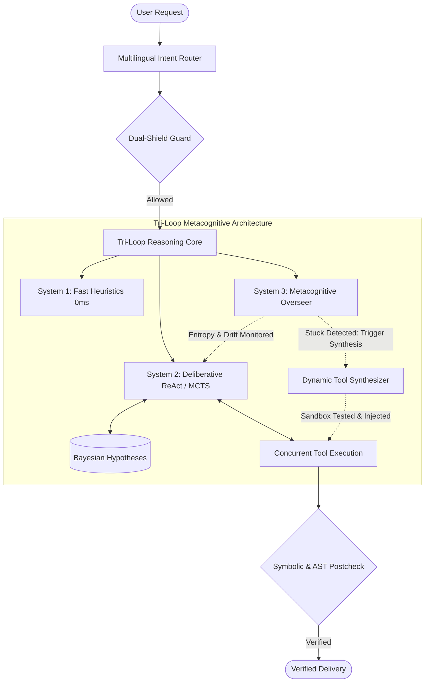

# Titan Agent (Universal Agent HP)

[](https://github.com/kapitan00000978-sketch/Universal-Agent-HP/actions/workflows/tests.yml)
[](https://opensource.org/licenses/MIT)
[](https://www.python.org/downloads/)
[](#architecture-tri-loop-metacognitive-execution)
[](#testing--security)

Titan Agent is a high-performance autonomous AI operating system designed to execute complex real-world software engineering, research, and system administration workflows with verified correctness and zero context drift.

```
   ┌────────────────────────────────────────────────────────────────────────┐
   │                       TITAN UNIVERSAL AGENT                            │
   │                                                                        │
   │   [System 1: Fast Intuition] ──> Instant Heuristic Path (0ms)          │
   │   [System 2: Planning Engine] ──> MCTS + Bayes Reasoning + TDD Loop     │
   │   [System 3: Metacognitive]   ──> Shannon Entropy + Dynamic Synthesis  │
   │   [Active Working Memory]     ──> Pinned Operational HUD (No Drift)    │
   └────────────────────────────────────────────────────────────────────────┘
```

---

## ⚠️ Important Notice Regarding Model Providers

This project supports standard commercial APIs (`groq`, `gemini`, `openrouter`), local self-hosted engines (`ollama`), as well as experimental providers. For maximum production stability, low latency, and security, configure `TITAN_PROVIDER` in your `.env` to official APIs or local Ollama instances.

---

## Installation

### Prerequisites
- Python 3.11 or higher
- Git

### Setup

```bash
# Clone the repository
git clone https://github.com/kapitan00000978-sketch/Universal-Agent-HP.git
cd Universal-Agent-HP

# Create and activate virtual environment
python -m venv .venv
source .venv/bin/activate  # On Windows: .venv\Scripts\activate

# Install dependencies and project package
pip install -r requirements.txt
pip install -e .
```

### Configuration

Copy the environment template and set your API keys:

```bash
cp .env.example .env
```

---

## Quick Start

### 1. One-Shot Execution
Execute a direct autonomous task from the command line:

```bash
universal "Write a python script that prints Hello World"
```

### 2. Interactive Terminal CLI
Launch the interactive terminal shell with live syntax highlighting and tool feedback:

```bash
universal
```

### 3. Mission Control Web Dashboard
Launch the web dashboard with real-time SSE event streams and telemetry:

```bash
universal --web
```

Open your browser at `http://localhost:7860` to access the Mission Control UI.

---

## Key Capabilities

- **Tri-Loop Metacognitive Reasoning Engine:**
  - **System 1 (Fast Intuition):** 0ms pattern-matched instant path bypassing heavy tool reasoning for simple queries.
  - **System 2 (Deliberative Planning):** Multi-hop ReAct, Tree-of-Thoughts, and Monte Carlo Tree Search (MCTS) with Bayesian candidate hypothesis tracking.
  - **System 3 (Metacognitive Overseer):** Real-time monitoring of Shannon cognitive entropy, hallucination drift, and cyclic dead-ends with autonomous strategy pivoting (MCTS, Adversarial Debate, or Tool Synthesis).
- **Autonomous TDD Engine (Red-Green-Refactor Loop):** Guarantees high-integrity software changes by strictly proving test failure first (RED), writing minimal passing code (GREEN), and verifying symbolic AST invariants (REFACTOR) in an isolated sandbox.
- **Active Working Memory Virtualizer:** Real-time operational HUD pinned into the system context, tracking confirmed facts, refuted dead-ends, key file paths, and active subtasks to eliminate context drift on long-horizon tasks.
- **Multi-Agent Consensus & Deliberation Engine:** Convenes an architectural committee (`Architect`, `SecurityOfficer`, `Pragmatist`) with weighted voting and signed consensus memos before executing risky or high blast-radius changes.
- **On-The-Fly Autonomous Tool & Skill Synthesis:** When a task requires capabilities not present in static registries, the agent writes the Python tool, executes verification tests in an isolated sandbox, compiles it, and hot-injects it into `ToolRegistry` during the live session.
- **Symbolic AST Invariant Checker:** Statically scans Python code prior to execution to detect infinite loops (`while True` without escape), command injection hazards, and resource leaks.
- **Mission Control Dashboard & Telemetry:** Real-time state-machine visualizer (`[01. Intent Routing] -> [02. Dual-Shield Guard] -> [03. Planning & MCTS] -> [04. Tool Execution] -> [05. Deep Verification] -> [06. Verified Delivery]`), live tool performance matrix, and real-time SSE event log streaming.
- **AST Code Intelligence & Surgical Patching:** Boundary-accurate replacement for functions and classes via `ASTPatcher`, preventing line-number offset errors.
- **Deep Test-Driven Verification:** Self-healing verification loop that autonomously runs `pytest` in isolated sandboxes with Docker or native fallback.
- **Dual-Shield Cyber Defense:** Integrated Blue Team security sentinels and emergency Red Team forensic analysis.
- **Enterprise-Grade Capabilities (Phase 47):**
  - **1-Line Model Context Protocol (MCP) Presets:** Instant connection to industry-standard MCP servers (`postgres`, `github`, `slack`, `brave_search`, `sqlite`, `filesystem`, `puppeteer`, `gdrive`) with standard environment mapping and automated tool discovery.
  - **Human-in-the-Loop (HITL) Dangerous Action Gate:** Automatic interceptor for catastrophic or irreversible operations (`rm -rf`, `delete_file`, `git push --force`, `.env`/secret modifications, raw disk writes) that halts and requests human authorization (`«Bu fayllarni/amallarni o‘zgartirmoqchiman. Ruxsat berasizmi? [Ha / Yo‘q]»`) via Web Dashboard, CLI, or Telegram.
  - **Automated GitOps Branching & PR Engine:** Enforces safe development hygiene by isolating work in clean feature branches (`agent/feature-<slug>`), enforcing test-suite pass gates before committing, and opening fully documented Pull Requests on GitHub.
  - **Semantic Caching Layer:** SQLite-backed word cosine vector cache that intercepts repeated or semantically equivalent queries/tool executions, returning instant 0ms responses and cutting token costs by 30–40%.
  - **Episodic Experience Replay:** Persistent error fingerprint repository that records past runtime errors, root causes, and verified code diffs. Instantly recalls proven remediation recipes when matching errors occur in future workflows.

---

## Architecture: Tri-Loop Metacognitive Execution



---

## 120-Stage Master Architecture Blueprint

The project is governed by a 120-stage progressive evolution roadmap spanning 6 core capability tracks:
1. **Stages 001–020:** Metacognitive Core & Tri-Loop Engine (Entropy, Bayesian Belief, Stagnation Breakers).
2. **Stages 021–040:** Autonomous Dynamic Tool & Skill Synthesis (Hot-Reloading, Sandbox Verifier, API Reverse-Engineering).
3. **Stages 041–060:** Deep Code Intelligence & Symbolic Invariants (AST Invariant Prover, Mutation Testing, Dependency Conflict Resolver).
4. **Stages 061–080:** Hierarchical Multi-Agent Swarm & Raft Consensus (Meta-Orchestrator, Department Leads, Raft Voting).
5. **Stages 081–100:** Persistent Multi-Tier Memory & Knowledge Graph (Causal Impact Analysis, WAL High Concurrency Storage).
6. **Stages 101–120:** Multimodal Telemetry, Visual Self-Correction & Industrial Delivery (Playwright DOM Inspector, Singularity Auto-Evolution).

For the full specification, see [120_stages_universal_agent_blueprint.md](120_stages_universal_agent_blueprint.md).

---

## Testing & Security

- **Tests:** Run the test suite with `pytest tests/ -q` (**675+ unit & integration tests, 100% green**).
- **Security:** Static analysis, AST invariant checking, and secret scanning are integrated directly into the tool execution funnel.

---

## Contributing

We welcome contributions! Please see our [CONTRIBUTING.md](CONTRIBUTING.md) for guidelines.

---

## Releases

For a history of stable releases and versioning, check the [Releases page](https://github.com/kapitan00000978-sketch/Universal-Agent-HP/releases).

---

## License

MIT License
