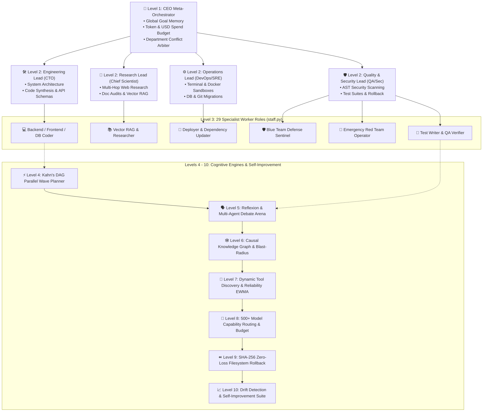

# Universal Agent HP

[](https://github.com/kapitan00000978-sketch/Universal-Agent-HP/actions/workflows/tests.yml)
[](https://opensource.org/licenses/MIT)
[](https://www.python.org/downloads/)
[](#architecture-genesis-10-level-cognitive-swarm-hierarchy-levels-1---10)
[](#testing--security)

Universal Agent HP is an autonomous AI software engineering and operations operating system built for real-world production environments. It fuses **Tri-Loop Metacognitive Reasoning**, an **Autonomous TDD Engine**, **Anthropic Model Context Protocol (MCP)** integration, **Human-in-the-Loop Guardrails**, and **Local Semantic Caching** into a verified, drift-free execution framework.

```
   ┌────────────────────────────────────────────────────────────────────────┐
   │                         UNIVERSAL AGENT HP                             │
   │                                                                        │
   │   [System 1: Fast Intuition] ──> Instant Heuristic Path (0ms)          │
   │   [System 2: Planning Engine] ──> MCTS + Bayes Reasoning + TDD Loop     │
   │   [System 3: Metacognitive]   ──> Shannon Entropy + Dynamic Synthesis  │
   │   [Active Working Memory]     ──> Pinned Operational HUD (No Drift)    │
   └────────────────────────────────────────────────────────────────────────┘
```

---

## Why Universal Agent HP? (Real-World Use Cases)

Universal Agent HP is engineered to solve acute, real-world engineering bottlenecks for developers, teams, and enterprises:

### 1. Autonomous Software Engineering & Self-Healing Bug Fixes
* **The Problem:** Developers spend hours manually isolating bugs, crafting regression tests, and repeatedly testing code fixes.
* **Universal Agent Solution:** Upon receiving an issue or bug report, the agent executes an autonomous **TDD cycle**: writes a failing verification test (`pytest`), confirms failure (RED), writes minimal passing code (GREEN), and asserts AST safety invariants (REFACTOR). If tests fail, the self-healing loop autonomously debugs and iterates until 100% green.

### 2. Safe GitOps: Automated Feature Branching & Pull Requests
* **The Problem:** Blind AI code agents directly writing to `main` or committing unverified code can compromise codebase stability.
* **Universal Agent Solution:** Isolates all development inside dedicated `agent/feature-<slug>` branches. The commit engine enforces a strict pass gate on the test suite before any git commit is permitted. Once verified, it automatically opens a formatted, context-rich Pull Request via `gh pr create`.

### 3. One-Line Ecosystem Integration (Anthropic Model Context Protocol)
* **The Problem:** Writing custom API adapters for disparate enterprise databases and services is slow and error-prone.
* **Universal Agent Solution:** Standardized MCP client enables 1-line connection to any industry-standard server:
  * `postgres`: Direct SQL inspection, schema analysis, and migrations
  * `github`: Repository management, issues, and PR workflows
  * `slack`: Real-time alerts, messaging, and team collaboration
  * `brave_search`: Live web search for latest documentation and dependencies
  * `filesystem` & `sqlite`: Secure local sandboxes and query engines

### 4. Halting Catastrophic Actions (Human-in-the-Loop Safety)
* **The Problem:** AI agents inadvertently executing destructive commands (`rm -rf`, `delete_file`, `git push --force`, or leaking credentials in `.env`).
* **Universal Agent Solution:** The `DangerousActionClassifier` intercepts irreversible actions and halts execution, prompting the operator across Terminal TUI, Web Dashboard, or Telegram:
  > *«Bu fayllarni/amallarni o‘zgartirmoqchiman. Ruxsat berasizmi? [Ha / Yo‘q]»*  
  Zero destructive actions execute without explicit human authorization.

### 5. Slashing LLM Token Costs by 30–40% (Semantic Caching)
* **The Problem:** Repetitive tool calls, static file reads, and semantically equivalent queries needlessly burn expensive model tokens.
* **Universal Agent Solution:** An embedded SQLite vector cache (`semantic_cache.db`) calculates word cosine similarity, returning **0ms** responses for matching or near-equivalent requests, cutting LLM bills by 30–40% with live token and dollar savings telemetry.

### 6. Continuous Learning from Historical Mistakes (Episodic Experience Replay)
* **The Problem:** Most AI agents repeat identical syntax, version conflict, and dependency errors across different sessions.
* **Universal Agent Solution:** Maintains an episodic failure repository (`experience_replay.db`). When runtime exceptions occur, it records normalized error fingerprints and verified remediation diffs, instantly recalling proven solutions when encountering similar errors in the future.

### 7. 100% Private & Air-Gapped Local AI
* **The Problem:** Organizations cannot expose proprietary source code to public third-party cloud APIs.
* **Universal Agent Solution:** First-class native integration with `Ollama` and `LM Studio` runs models entirely locally on your hardware. Zero bytes leave your infrastructure.

---

## Transparent Capabilities: What It Can and Cannot Do

### ✅ Real, Verified Capabilities (Backed by 675+ Passing Tests):
1. **Tri-Loop Metacognitive Reasoning Engine:**
   * **System 1 (Fast Intuition):** 0ms instant heuristic dispatch bypassing tool execution for direct conversational prompts.
   * **System 2 (Deliberative Planning):** Tree-of-Thoughts, Multi-Hop ReAct, and Monte Carlo Tree Search (MCTS) with Bayesian hypothesis tracking.
   * **System 3 (Metacognitive Overseer):** Real-time monitoring of Shannon cognitive entropy and stagnation breakers that autonomously pivot strategy when stuck.
2. **Surgical AST Code Patching:** Identifies exact AST target nodes to replace functions and classes without line-number offset errors.
3. **Symbolic AST Safety Scanner:** Statically detects unbounded `while True` loops, dangerous shell injections (`subprocess` with `shell=True`), and resource leaks before code execution.
4. **Three Production-Ready Interfaces:**
   * **Terminal TUI:** Full-screen Textual dark interface (`python run.py`).
   * **Mission Control Web Dashboard:** Real-time visual control panel with SSE telemetry (`python run.py --web`).
   * **Interactive Terminal CLI & Telegram:** Lightweight console shell and remote mobile bot.
5. **Comprehensive Automated Verification:** 680+ unit and integration tests verified 100% green on every commit via GitHub Actions CI across Python 3.11 and 3.12.
6. **Multimedia & 3D Engineering (Video Montage & Blender bpy):**
   * **Automated Video Editing:** Zero-loss cuts (`-c copy`), dynamic aspect ratio conversion (16:9 to vertical 9:16 for Reels/Shorts/TikTok), multi-track audio sync, and speed alterations powered by `VideoEngine` and FFmpeg.
   * **Headless Blender 3D (bpy):** Procedural 3D mesh synthesis (cubes, spheres, cylinders, toruses), PBR material assignment (`Principled BSDF`), 3-point studio lighting, and background batch rendering via `BlenderEngine`.

### ⚠️ Realistic Boundaries & Limitations:
1. **Requires an LLM Engine:** Universal Agent HP is a cognitive orchestration and verification operating system; underlying reasoning power depends on the connected model (Claude 3.5 Sonnet, GPT-4o, DeepSeek, or local Llama 3).
2. **Destructive Operations Require Consent:** By design, the agent cannot bypass security guardrails or execute destructive operations without operator authorization.
3. **Third-Party Provider Rate Limits:** When external commercial APIs experience rate limits or outages, the agent falls back to cached responses or configured fallback providers.

---

## Quick Start & Installation

### 1. Prerequisites & Installation

```bash
# Clone the repository
git clone https://github.com/kapitan00000978-sketch/Universal-Agent-HP.git
cd Universal-Agent-HP

# Create and activate virtual environment
python -m venv .venv
source .venv/bin/activate  # On Windows: .venv\Scripts\activate

# Install dependencies and local package
pip install -r requirements.txt
pip install -e .
```

### 2. Configuration

Copy the template configuration and configure your model provider:

```bash
cp .env.example .env
```

For 100% offline execution with local Ollama:
```env
TITAN_PROVIDER=ollama
TITAN_MODEL=llama3:latest
```

---

## 3 Flexible Ways to Launch

### Option 1: Ultra-Modern Terminal TUI (OpenCode / Textual Style)
Launch the full-screen terminal interface directly:

```bash
python run.py
```
* <kbd>Shift</kbd> + <kbd>Tab</kbd>: Open 27 Specialist Agents Matrix
* <kbd>Ctrl</kbd> + <kbd>P</kbd>: Command Palette (`/dag`, `/debate`, `/mcp`, `/pr`, `/rollback`, `/status`)
* <kbd>Ctrl</kbd> + <kbd>L</kbd>: Clear terminal log

### Option 2: Mission Control Web Dashboard
Launch the graphical browser interface with live telemetry and SSE event logs:

```bash
python run.py --web
```
Open `http://localhost:7860` in your browser.

### Option 3: Interactive Terminal CLI

```bash
universal --cli
```

---

## Autonomous Execution Lifecycle (Closed-Loop Engine)

Universal Agent HP processes every complex engineering task through a disciplined **6-stage closed-loop lifecycle**:

```
┌──────────────────────────────────────────────────────────────────────────┐
│              UNIVERSAL AGENT HP — AUTONOMOUS LIFECYCLE                   │
├──────────────────────────────────────────────────────────────────────────┤
│                                                                          │
│  [01. Intent Routing & Recall]                                           │
│   ├── Multilingual intent classification (Router)                        │
│   ├── Semantic Cache lookup (0ms exact/fuzzy hit returns immediately)    │
│   └── Working Memory HUD (in-place operational context anchoring)        │
│                                │                                         │
│                                ▼                                         │
│  [02. Dual-Shield & HITL Guard]                                          │
│   ├── Static AST injection and secret credential scanning                │
│   └── Dangerous Action Gate (HITL approval prompts):                     │
│       «Bu fayllarni/amallarni o‘zgartirmoqchiman. Ruxsat berasizmi?»     │
│                                │                                         │
│                                ▼                                         │
│  [03. Deliberative Planning & Consensus]                                 │
│   ├── Multi-hop ReAct, Tree-of-Thoughts & MCTS hypothesis planning       │
│   ├── Consensus Committee (Architect, Security, Pragmatist) weighted vote│
│   └── Missing capability detection -> On-the-fly Dynamic Tool Synthesis  │
│                                │                                         │
│                                ▼                                         │
│  [04. Concurrent Execution & Active Context]                             │
│   ├── 1-line MCP presets (Postgres, GitHub, Slack, Brave Search)         │
│   ├── Episodik Experience Replay: automatic error fingerprint lookup     │
│   └── Working Memory Virtualizer: real-time confirmed facts & dead ends  │
│                                │                                         │
│                                ▼                                         │
│  [05. Deep Verification & TDD Loop]                                      │
│   ├── Strict TDD cycle: RED (prove failure) -> GREEN -> REFACTOR         │
│   ├── Hermetic sandbox pytest runner (Deep Verifier)                     │
│   └── Shannon entropy telemetry: cyclic stagnation & dead-end breaks     │
│                                │                                         │
│                                ▼                                         │
│  [06. GitOps Delivery & Verified PR]                                     │
│   ├── Clean feature branch isolation (agent/feature-<slug>)              │
│   ├── Test-suite pass gated atomic git commit                            │
│   └── Automated, fully documented Pull Request (PR) opening on GitHub    │
│                                                                          │
└──────────────────────────────────────────────────────────────────────────┘
```

---

## Architecture: Genesis 10-Level Cognitive Swarm Hierarchy (Levels 1 - 10)

Universal Agent HP operates as a hierarchical, corporate-level cognitive organization:



### Detailed Specifications of Levels 1 to 10:

* **Level 1 — CEO Meta-Orchestrator:**
  * Maintains global project mission, overarching objectives, and multi-turn context (`Global Goal Memory`).
  * Enforces token consumption caps and monetary USD budgets.
  * Serves as final arbitrator for conflicting inter-departmental proposals (`Department Conflict Arbiter`).
* **Level 2 — 4 Department Team Leads:**
  * **Engineering Lead (CTO):** System architecture, interface contracts, code generation, and API schemas.
  * **Research Lead (Chief Scientist):** Internet exploration, documentation auditing, and multi-hop Vector RAG.
  * **Operations Lead (DevOps/SRE):** Terminal command execution, Docker container sandboxes, database migrations, and Git operations.
  * **Quality & Security Lead (QA/Sec):** AST vulnerability scanning, regression test suites, and automated sandbox rollback.
* **Level 3 — 29 Specialist Worker Roles (`staff.py`):**
  * `Backend / Frontend / DB Coder`, `Vector RAG & Researcher`, `Deployer & Dependency Updater`, `Blue Team Defense Sentinel`, `Emergency Red Team Operator`, `Test Writer & QA Verifier`, and specialized domain agents.
* **Levels 4 - 10 — Cognitive Engines & Continuous Self-Improvement:**
  * **Level 4: Kahn's DAG Parallel Wave Planner:** Decomposes complex tasks into directed acyclic graphs and executes independent wave tasks concurrently.
  * **Level 5: Reflexion & Multi-Agent Debate Arena:** Facilitates adversarial deliberation between agents to surface edge cases before code execution.
  * **Level 6: Causal Knowledge Graph & Blast-Radius:** Maps codebase dependencies and predicts ripple effects of proposed modifications.
  * **Level 7: Dynamic Tool Discovery & Reliability EWMA:** Evaluates tool execution stability using exponentially weighted moving averages and synthesizes new tools on-the-fly.
  * **Level 8: 500+ Model Capability Routing & Budget:** Optimizes model selection per subtask to balance latency, reasoning depth, and cost.
  * **Level 9: SHA-256 Zero-Loss Filesystem Rollback:** Takes cryptographic state snapshots prior to modifications, enabling instant 0ms restoration upon failure.
  * **Level 10: Drift Detection & Self-Improvement Suite:** Continuously monitors for cognitive context drift and refines system rules over time.

---

## Testing & Security

* **Automated Test Suite:** Execute tests via `pytest tests/ -q` (**675+ unit and integration tests passing 100% green**).
* **Integrated Security:** AST invariant verification, secret scanning, and destructive command interception are embedded directly into the execution pipeline.

---

## Contributing

Contributions are welcome! Please consult [CONTRIBUTING.md](CONTRIBUTING.md) for contribution guidelines.

---

## License

This project is licensed under the [MIT License](LICENSE).
